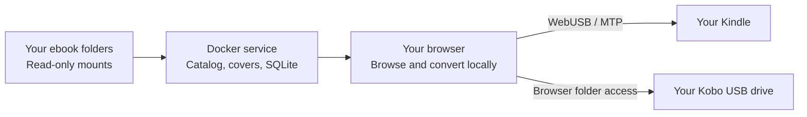

<p align="center">
  
</p>

<h1 align="center">ShelfSend</h1>

<p align="center">
  <strong>Send books to your e-reader. Straight from your browser.</strong><br>
  Your books. Your e-reader. Just a browser between them.
</p>

<p align="center">
  
  
  
  
</p>

<p align="center">
  <a href="#features">Features</a> ·
  <a href="#quick-start">Quick start</a> ·
  <a href="#send-to-your-ereader">Send to your e-reader</a> ·
  <a href="#series-discovery">Series discovery</a> ·
  <a href="#compatibility">Compatibility</a> ·
  <a href="#documentation">Documentation</a>
</p>

---

Plug in your e-reader, open ShelfSend, and transfer your books over USB. EPUB conversion for Kindle happens right in your browser—no desktop transfer app, no cloud conversion, no emailing files to your device. Kobo receives EPUBs directly through the browser's folder access.

Run ShelfSend on your own server with Docker, then connect your e-reader to the computer you're browsing from. Your existing book folders become a searchable catalog, and your original files stay untouched. No Calibre installation or cloud book storage is required.

> [!NOTE]
> **Supported readers:** Kindle and Kobo. See the [device guide](docs/devices.md) for connection methods, formats, and reader-specific capabilities.

<a id="features"></a>
## ✨ Features

| Feature | What it means for you |
| --- | --- |
| 🔌 **Your browser is the bridge** | Connect your Kindle or Kobo to your computer and send books directly over USB, without leaving the browser. |
| 📤 **One book or a whole stack** | Select your books and transfer them together, with clear progress and verification for each title. Build a **Send later** queue whenever inspiration strikes. |
| ⚡ **EPUB conversion, built in** | Send EPUBs to your Kindle without preparing files in another app. ShelfSend handles conversion locally in your browser. |
| ✅ **See what's already on your device** | Browse the Kindle's full scanned inventory from **On Kindle** in the sidebar, including books outside your libraries. Within a library, use the device filters to see confirmed matches or books ready to send. |
| 📚 **Find the gaps in your series** | Explore a book series through Hardcover and compare its titles with your library. See which volumes you already own and which you're missing, with uncertain matches shown separately. |
| 🏠 **Host your library. Connect wherever you read.** | Run ShelfSend on your own server and access it through a supported desktop browser over your private LAN/VPN. Your e-reader connects to the computer you're using. |
| 🗂️ **Your collection, ready to send** | Keep books in your existing folders. ShelfSend indexes them automatically, so they're searchable and ready for your next transfer. |

<details>
<summary><strong>Plus the tools to keep your library in shape</strong></summary>

Browse covers or compact lists in light or dark mode. Organize household profiles, smart shelves, favorites, and reading wishlists. Edit metadata and covers without changing your original ebooks, and review missing metadata, duplicate choices, and source problems in **Needs attention**.

For eligible Kindle copies, update an edited EPUB or explicitly confirm removal of exact matched books. These update/removal actions are Kindle-specific; Kobo currently supports adding EPUBs without replacing or removing existing books.

</details>

<a id="quick-start"></a>
## 🚀 Quick start

You need **Docker with Docker Compose**, a folder of DRM-free EPUB or supported AZW3 files, and **desktop Chrome or Edge** with WebUSB for Kindle or folder access for Kobo. Use a trusted HTTPS origin for remote access; localhost also works.

### 1. Start the library

From a checkout of this repository, start the library with the default book folder:

```sh
mkdir -p library
# Place your ebooks in the library folder.
docker compose up --build -d
```

To use an existing book folder or customize the service, follow the [deployment configuration](deploy/docker/README.md#3-configure-and-start).

Open **[http://127.0.0.1:8080](http://127.0.0.1:8080/)** on the Docker host.

### 2. Set up your household library

Follow the first-run wizard to create a profile, choose **`/libraries`** as its folder, and check indexing. You can skip the optional connection step and choose your e-reader from **Connect eReader** after setup. Reopen the wizard from **Settings → Run setup wizard**.

Settings uses paths **inside the container**. If your host folder is mounted at `/libraries`, enter `/libraries` or a subfolder such as `/libraries/fiction`—never the host path or an SMB URL.

### 3. Browse and send

Once indexing finishes, browse your covers, organize shelves, or queue books with **Send later**. Connect your Kindle or Kobo when you are ready to transfer.

> [!IMPORTANT]
> The default deployment listens on loopback and has no built-in login. For another computer on your LAN/VPN, configure a private HTTPS origin trusted by that browser using the [deployment guide](deploy/docker/README.md). Profiles organize books; they do not restrict access. Remote reader access requires HTTPS.

<a id="send-to-your-ereader"></a>
## 🔌 Send to your e-reader

Choose your reader from **Connect eReader**. Connect one device at a time, using a USB cable that supports data transfer.

<a id="send-to-kindle"></a>
### Kindle

1. **Connect.** Plug the Kindle into your computer and choose **Connect eReader → Kindle** to open the browser's device chooser.
2. **Check.** ShelfSend automatically runs an exact-byte write/read/delete self-test, reads the device inventory, and compares it with your selected library before enabling Send. The header shows indexing progress and how many books have been checked; the first connection can take longer.
3. **Choose.** Send an eligible missing book, select multiple titles in list view, or review your **Send later** queue.
4. **Transfer.** The browser validates the source, converts EPUBs locally, prepares the Kindle copy, and uploads and verifies each book. Batch progress identifies completed titles and keeps unsent titles selected after a failure.
5. **Read.** Open the transferred title on your Kindle. Prepared sideloads use personal-document metadata so embedded covers can appear in the library; Kindle classifies them under **Documents**.

**On Kindle** shows covers extracted from the device files themselves—not matching library artwork. Covers load as you browse after a complete device scan and are cached only in your browser. Missing, encrypted, unsupported, or oversized files keep a placeholder; cover previews never change your books or library matching.

### Kobo

1. **Connect.** Plug Kobo into your computer and choose **Connect** on the reader so its drive appears.
2. **Allow access.** Choose **Connect eReader → Kobo**, select the main Kobo drive containing `.kobo`, and grant the browser folder access.
3. **Send.** Wait for the library comparison, then choose **Send to Kobo** for an eligible EPUB, a list selection, or your **Send later** queue. ShelfSend prepares any metadata/cover edits in a derived EPUB, writes to its own folder, and verifies the transferred bytes.
4. **Eject and read.** Safely eject the drive using your operating system, unplug, and let Kobo import the books. ShelfSend's **Disconnect** button does not eject the drive.

Kobo transfer currently supports DRM-free EPUBs. Existing device books and Kobo's internal database stay untouched. KEPUB conversion, AZW3 transfer, and existing-book update/removal are not supported. Only verified current ShelfSend copies receive confirmed badges; other books can remain possible matches.

<details>
<summary><strong>Updating and removing Kindle copies</strong></summary>

Use the book's three-dot menu to open **Edit metadata & cover**. Corrections are stored separately from the source. For an edited EPUB with one freshly confirmed stale ShelfSend-managed copy, **Update Kindle copy** uploads and verifies the replacement, durably records it, then revalidates and deletes only the exact old copy. The device needs enough temporary room for both files; ShelfSend never switches to delete-first replacement.

**Remove from Kindle** shows the exact filenames and sizes and requires confirmation. Each selected object is revalidated before deletion. Possible or fuzzy matches do not authorize removal, and host library originals remain unchanged.

See the [complete workflow and safety rules](docs/technical-guide.md#device-workflows-and-safety) for recovery, matching, cache behavior, and session handling.

</details>

<a id="series-discovery"></a>
## 📚 Find the gaps in your series

Open **View series** from a book's details to explore its series through Hardcover and compare the titles against your entire selected library. See the volumes you own, spot missing entries, and jump straight to a matching local book. Uncertain matches stay separate from missing titles, and books belonging to multiple series let you choose which one to explore.

Add and test your Hardcover personal API token in **Settings → Series & book details (Hardcover)** to enable discovery. The token stays on your server. Series comparison helps you understand your collection; it does not download missing books or change your files. You can separately review and apply suggested series metadata through the metadata editor.

<a id="compatibility"></a>
## 📖 Compatibility

| Area | Current support |
| --- | --- |
| **EPUB** | Preferred source format. Converted to AZW3 locally for Kindle with boko WebAssembly; sent as EPUB to Kobo. |
| **AZW3** | Uncompressed or PalmDOC-compressed KF8 sources. HUFF/CDIC compression and embedding edited AZW3 metadata/covers are unsupported. |
| **DRM** | DRM-protected ebooks are unsupported. |
| **File size** | Source downloads are limited to 200 MiB; conversion also enforces bounded resource limits. |
| **Kindle** | Browser-local WebUSB/MTP. The original transfer engine was physically tested on an MTP Kindle with USB IDs `0x1949 / 0x9981`. |
| **Kobo** | Browser folder access to its mounted USB drive in desktop Chrome or Edge. DRM-free EPUB transfer; physical acceptance is pending. |
| **Other e-readers** | No current compatibility claim beyond the Kindle and Kobo implementations described here. |
| **KFX / AZW8 inventory** | Visible Kindle presence with incomplete metadata. Experimental metadata enrichment remains disabled by default. |
| **Reading information** | Read-only recorded Kindle activity is available in book details. Automatic reading percentage and Read/Unread detection remain disabled. |

> [!NOTE]
> **Validation status:** the original physical Kindle test confirmed conversion, transfer, opening, chapter navigation, and cover display. The expanded catalog, queue, update, removal, and reconnect flow still needs fresh physical acceptance, along with the real household mounts and intended private HTTPS origin. Kobo software checks verify transfer behavior with fixtures; physical Kobo transfer, import, opening, covers, and navigation still need acceptance. Automated checks do not establish those results.

<details>
<summary><strong>About reading data and the Read books shelf</strong></summary>

Open a book's details to inspect **Kindle reading data** for a confirmed copy, including available recorded time, counted words, saved positions, and timestamps. Observations remain in the browser session; last-seen data is labelled, and no durable device reading history is promised.

The **Read books** shelf stores durable per-profile completion membership. Recorded timer activity does not establish completion and never automatically adds membership. Automatic reading status remains disabled because physical comparison showed that timer fractions do not match the Kindle's displayed percentage or Read status.

See [reading information and limitations](docs/technical-guide.md#reading-information-and-read-books).

</details>

## ⚙️ Configuration and storage

Use **Settings** to manage profiles, library folders, and optional metadata providers. Open Library and local cover upload/paste need no API key. A Google Books key can be added and tested in Settings; credentials stay in durable server storage and are never returned unmasked or persisted in the browser. Hardcover series discovery uses a separate personal API token configured in Settings. Provider results are reviewed before becoming metadata overlays.

| Container path | Purpose | Storage |
| --- | --- | --- |
| `/libraries` | Your original ebooks | Read-only host mount; defaults to `./library` |
| `/data` | SQLite state, settings, queues, annotations, metadata overrides, and replacement covers | Persistent data volume (see [deployment settings](deploy/docker/README.md)) |
| `/cache` | Rebuildable index/cover cache files | Rebuildable cache volume (see [deployment settings](deploy/docker/README.md)) |

The Docker host makes local or NAS-backed folders available through ordinary mounts. ShelfSend does not mount SMB/NFS shares or receive their credentials. Add more read-only mounts in Compose if folders cannot share one mounted parent, and keep configured roots beneath `CATALOG_ALLOWED_ROOTS`.

<details>
<summary><strong>Common deployment settings</strong></summary>

| Setting | Purpose |
| --- | --- |
| `CATALOG_ALLOWED_HOSTS` | Accepted host headers for your deployment |
| `CATALOG_ALLOWED_ORIGINS` | Trusted web origins |
| `CATALOG_REQUIRE_ORIGIN` | Origin enforcement; enabled by default in Compose |
| `CATALOG_SETTINGS_MODE` | `read-write` for configuration or `read-only` to lock Settings mutations |

Use the [server configuration reference](server/README.md) for scanner, parser, concurrency, deadline, and retention controls. Follow the [Docker operations guide](deploy/docker/README.md) for HTTPS, backup, restore, rollback, and mount-loss recovery.

</details>

## 🧭 How it works



The server indexes and serves source files. The browser prepares derived copies and operates USB. Metadata edits live separately under `/data`; conversion never rewrites a mounted original. Device inventory and metadata caches stay on the browser/device side and are never sent to the backend or cloud.

<a id="documentation"></a>
## 📚 Documentation

| Guide | Contents |
| --- | --- |
| [Device guide](docs/devices.md) | Shared workflow, supported readers, connection methods, formats, and device-specific limits |
| [Technical guide](docs/technical-guide.md) | Catalog architecture, device workflows, safety, caching, and diagnostics |
| [Kobo transfer notes](outputs/kobo-build-plan.md) | Browser requirements, supported formats, recovery, and physical acceptance status |
| [Series discovery](outputs/hardcover-discovery.md) | Hardcover integration, library comparison, and matching behavior |
| [Docker deployment](deploy/docker/README.md) | Installation, private HTTPS, storage, backups, restore, and rollback |
| [Server reference](server/README.md) | Catalog service configuration and environment variables |
| [Project handoff](PROJECT_HANDOFF.md) | Architecture decisions, implementation state, and remaining acceptance work |
| [Backlog](BACKLOG.md) | Implementation and acceptance ledger |
| [Release-candidate audit](outputs/kindle-bridge-backlog-feature-audit.md) | Requirement-by-requirement coverage and validation evidence |

## 🙏 Acknowledgements and licensing

ShelfSend is licensed under the **GNU General Public License, version 3 or (at your option) any later version** (`GPL-3.0-or-later`). See [LICENSE](LICENSE) for the full terms. Third-party components retain their respective licenses and copyright notices.

Browser-local EPUB conversion uses **boko 0.5.0**, distributed under GPL-3.0-or-later. The required WebAssembly artifact is included in `client/vendor/boko`, with corresponding source and license material in [`third_party/boko`](third_party/boko).

Read the project [license](LICENSE) and [third-party notices](THIRD_PARTY_NOTICES.md) before redistribution.
